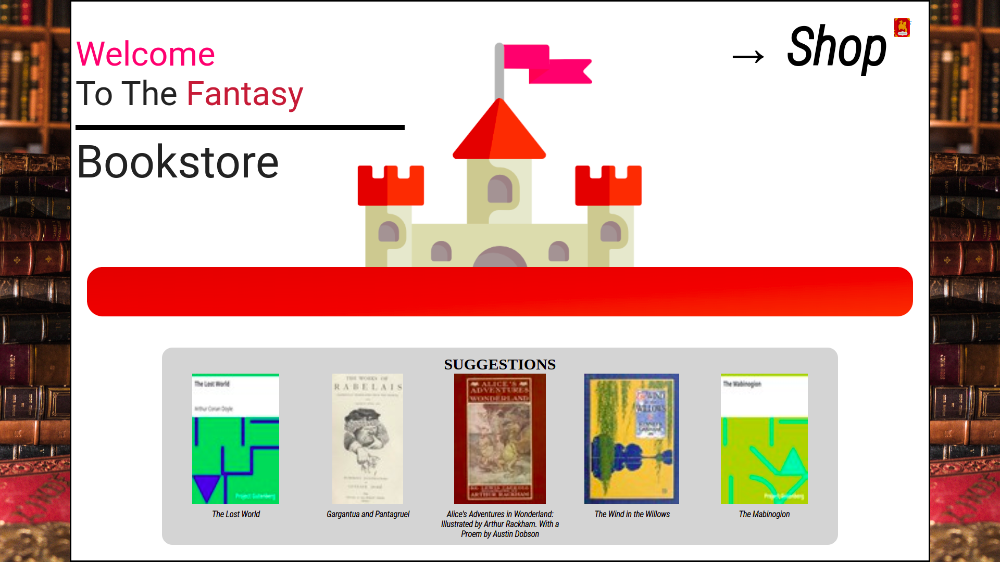

### Fantasy Bookstore

↳<a href='https://kiwasthal.github.io/shopping-cart/'>Deployed here with GitHub pages</a>

<h3>Features</h3>
<ul>
  <li>React Routing</li>
  <li>Custom hooks</li>
  <li>Fetched data from <a href='https://gutendex.com/'>gutendex api</a></li>
  <li>React testing library</li>
  <li>Cool Animations</li>
</ul>

# About

When the app is launched a loading animation is displayed until the book data is fetched from gutendex api. Afterwards will be able to navigate to the shop view browsing and adding to his cart the various book elements, created by the fetched data. Each time his cart get's updated a dropdown displays his current 'cart' along with information regarding each book's price , title e.t.c along with a total price of items collected. Then the user is able to proceed to the checkout screen where he can make alterations to the quantities of each item selected from the shop screen.

### `npm start`

Runs the app in the development mode.\
Open [http://localhost:3000](http://localhost:3000) to view it in your browser.

The page will reload when you make changes.\
You may also see any lint errors in the console.

### `npm test`

Launches the test runner in the interactive watch mode.\
See the section about [running tests](https://facebook.github.io/create-react-app/docs/running-tests) for more information.

### `npm run build`

Builds the app for production to the `build` folder.\
It correctly bundles React in production mode and optimizes the build for the best performance.

The build is minified and the filenames include the hashes.\
Your app is ready to be deployed!

See the section about [deployment](https://facebook.github.io/create-react-app/docs/deployment) for more information.
